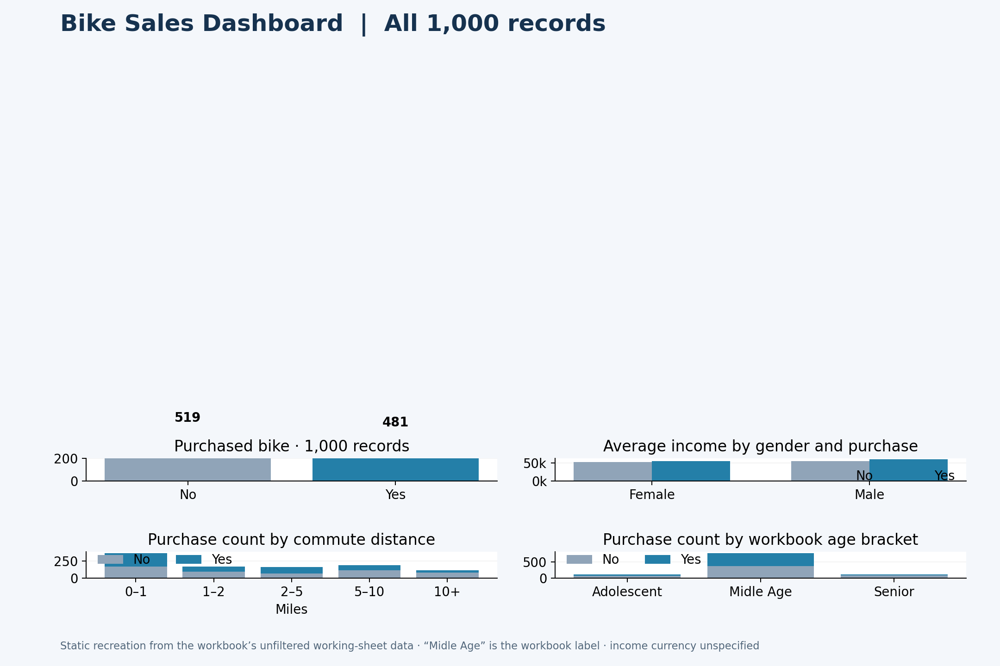

# Bike Sales Dashboard | Excel Data Analysis Practice

An Excel practice project exploring patterns in a bike buyer dataset. I built this workbook while following an **Alex The Analyst tutorial**. The project concept and dataset come from that learning material; this repository presents my practice work, not an original dataset or independent research study.

## Project overview

The workbook opens on `Working Sheet`, which contains the prepared data used for analysis. The separate `bike_buyers` tab retains the raw source; the other tabs contain PivotTables and the interactive dashboard. The dashboard compares bike purchases by income, commute distance, and age group. The public workbook opens with every slicer item selected. PivotTables and charts are set to refresh on opening in Excel so they summarize all **1,000** records.

## Dataset

The raw `bike_buyers` tab has 1,026 data rows and 13 fields: ID, marital status, gender, income, children, education, occupation, home ownership, cars, commute distance, region, age, and whether a bike was purchased. The workbook's `Working Sheet` has 1,000 distinct IDs. The 26 additional rows at the end of the source tab duplicate earlier complete rows. The dataset was supplied through the tutorial; this workbook does not document an independent collection method or the dataset's original publisher.

## Data cleaning and preparation

- Preserved the source tab and created a separate `Working Sheet` with the 1,000 distinct records.
- Expanded the source codes `M`/`S` for marital status to `Married`/`Single`, and `M`/`F` for gender to `Male`/`Female`.
- Added an `Age Brackets` column with a nested `IF` formula: under 31, 31–59, and over 59. The workbook's actual labels are `Adolescent`, `Midle Age`, and `Senior`; `Midle Age` is misspelled in the source workbook and is retained here to preserve the original analysis.

The final workbook shows the cleaned result, but its edit history does not establish which Excel command was used to remove duplicate rows. No Power Query, macros, or external data connection is present.

## Analysis, PivotTables, and dashboard

Four PivotTables in the `Pivot Table` tab compare purchase status with (1) average income by gender, (2) counts by commute distance, (3) counts by age bracket, and (4) counts by individual age. The tab also contains four charts. The `Dashboard` tab has three charts and slicers for marital status, children, education, and region. These slicers are connected to the four PivotTables. Open the workbook in Microsoft Excel to use the interactive controls; the image above is a static visual summary of the saved selection, not a screenshot of Excel's controls.

### Observations across all 1,000 records

- **481 of 1,000** buyers purchased a bike (**48.1%**).
- For a **0–1 mile** commute, **200 of 366** purchased a bike; for **10+ miles**, **33 of 111** did. These are descriptive group comparisons, not evidence that commute distance causes a purchase.
- The `Midle Age` group has **405 purchases out of 775** records. The source label and its age boundaries are kept as defined in the workbook.
- Average income is approximately **54,875** for non-purchasers and **57,963** for purchasers. The workbook does not specify a currency, so none is assumed here.

The public copy selects all slicer values and requests a PivotTable refresh when opened in Microsoft Excel. The static image presents the unfiltered totals calculated from the 1,000 working-sheet records.

## Skills demonstrated

Excel data preparation, categorical standardization, nested `IF` formulas, PivotTables, PivotCharts, and slicer-based dashboard presentation. This project does not claim experience with tools or methods absent from the workbook.

## Tools used

Microsoft Excel.

## Project files

| File | Description |
| --- | --- |
| [`workbook/bike_sales_excel_dashboard.xlsx`](workbook/bike_sales_excel_dashboard.xlsx) | Original project structure and Excel features, with personal author and local-path metadata removed for public sharing. |
| [`assets/dashboard_preview.png`](assets/dashboard_preview.png) | Static visual summary calculated from all 1,000 working-sheet records. |

## Learning source / credits

Developed as hands-on practice while following **Alex The Analyst's Excel dashboard tutorial**. Credit for the tutorial concept and supplied dataset belongs to the tutorial and its source. This repository documents the Excel work visible in my completed workbook. No specific video URL is included because the workbook does not identify one.
